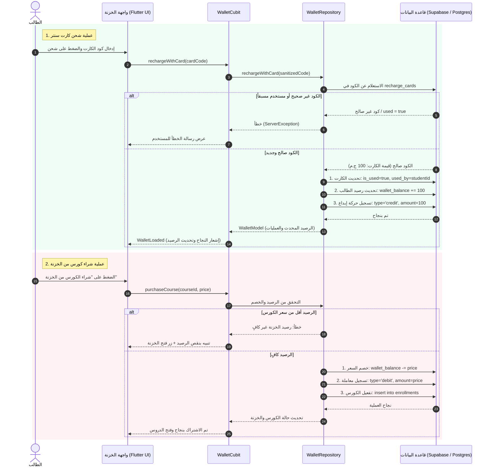
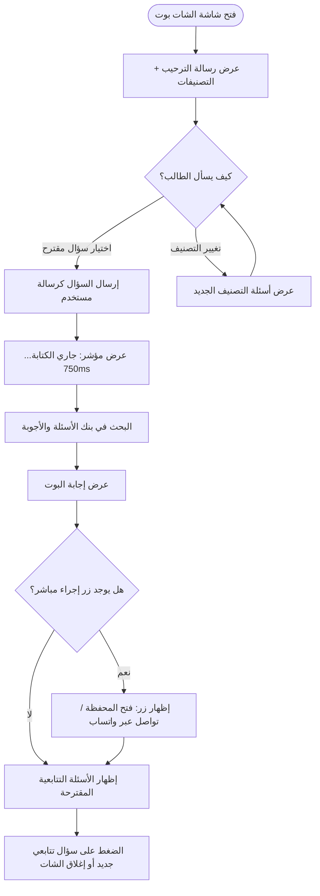

# الدليل الشامل لميزتي: الخزنة (المحفظة) والمساعد الذكي (الشات بوت)
### دليل تقني ومعماري لإعادة الاستخدام في تطبيقات Flutter جديدة

---

## الفهرس
1. [الميزة الأولى: خزنة الطالب (Wallet & Safe System)](#الميزة-الأولى-خزنة-الطالب-wallet--safe-system)
   - [1.1 الفكرة العامة والهدف](#11-الفكرة-العامة-والهدف)
   - [1.2 قصص المستخدم (User Stories) ومعايير القبول](#12-قصص-المستخدم-user-stories-ومعايير-القبول)
   - [1.3 مخطط تدفق العمليات (System Architecture & Flow)](#13-مخطط-تدفق-العمليات-system-architecture--flow)
   - [1.4 هيكل جداول قاعدة البيانات (Database Schema - SQL)](#14-هيكل-جداول-قاعدة-البيانات-database-schema---sql)
   - [1.5 الهيكل البرمجي في Flutter (Clean Architecture)](#15-الهيكل-البرمجي-في-flutter-clean-architecture)
   - [1.6 آلية حماية الأكواد ومنع الاحتيال (Security & Validation)](#16-آلية-حماية-الأكواد-ومنع-الاحتيال-security--validation)
2. [الميزة الثانية: المساعد الذكي التفاعلي (Interactive Chatbot)](#الميزة-الثانية-المساعد-الذكي-التفاعلي-interactive-chatbot)
   - [2.1 الفكرة العامة والهدف](#21-الفكرة-العامة-والهدف)
   - [2.2 قصص المستخدم (User Stories)](#22-قصص-المستخدم-user-stories)
   - [2.3 مخطط سير محادثة الشات بوت (Conversation Flow)](#23-مخطط-سير-محادثة-الشات-بوت-conversation-flow)
   - [2.4 الهيكل البرمجي ونموذج البيانات](#24-الهيكل-البرمجي-ونموذج-البيانات)
   - [2.5 دعم التوجيه الذكي (Deep Action Routing)](#25-دعم-التوجيه-الذكي-deep-action-routing)
3. [دليل النقل والتركيب في تطبيق جديد (Step-by-Step Migration Guide)](#دليل-النقل-والتركيب-في-تطبيق-جديد-step-by-step-migration-guide)

---

# الميزة الأولى: خزنة الطالب (Wallet & Safe System)

## 1.1 الفكرة العامة والهدف
"الخزنة" هي نظام محفظة إلكترونية رقمية داخل التطبيق (Closed-Loop In-App Wallet)، تتيح للطلاب:
1. شحن رصيدهم عبر **كروت سنتر ورقية مسبقة الدفع (Prepaid Scratch Cards)** تحتوي على أكواد فريدة.
2. استخدام الرصيد المشحون لشراء الكورسات، الحصص، أو الملازم داخل المنصة بضغطة زر دون الحاجة لبطاقات بنكية في كل مرة.
3. متابعة رصيدهم، ومجموع ما تم شحنه ومجموع ما تم إنفاقه، مع سجل كامل ومفصل لكافة العمليات المالية (إيداع وخصم).

---

## 1.2 قصص المستخدم (User Stories) ومعايير القبول

### 🟢 قصة المستخدم 1: استعراض رصيد الخزنة
> **بصفتي** طالباً في المنصة،  
> **أريد** أن أفتح شاشة الخزنة لأرى رصيدي الحالي المتاح وإجمالي ما قمت بشحنه وما أنفقته،  
> **حتى** أكون على دراية بوضعي المالي وقدرتي على الاشتراك في الكورسات الجديدة.

**معايير القبول (Acceptance Criteria):**
* يظهر الرصيد الحالي بشكل بارز بخط كبير ومميز (بالجنيه/العملة).
* وجود زر عين (`Visibility Toggle`) لإخفاء أو إظهار الرصيد لحماية الخصوصية عند استخدام التطبيق في أماكن عامة.
* عرض بطاقتين إحصائيتين:
  * إجمالي ما تم شحنه (Total Recharged).
  * إجمالي المصروفات (Total Spent).
* دعم ميزة السحب للأسفل لتحديث البيانات (`RefreshIndicator`).

---

### 🟢 قصة المستخدم 2: شحن الرصيد بكارت سنتر (Recharge via Card)
> **بصفتي** طالباً اشتريت كارت شحن من السنتر أو المكتبة،  
> **أريد** إدخال كود الكارت في خانة الشحن والضغط على "شحن الرصيد"،  
> **حتى** يضاف المبلغ المخصص للكارت إلى رصيد خزنتي فوراً وبدون تدخل بشري.

**معايير القبول (Acceptance Criteria):**
* حقل إدخال كود الشحن مع زر لصق سريع من الحافظة (`Paste from Clipboard`).
* تنظيف المدخلات تلقائياً (إزالة المسافات الزائدة، تحويل الحروف للإنجليزية الكبيرة `UPPERCASE`).
* فحص الكارت في قاعدة البيانات:
  * إذا كان الكود **غير موجود**: تظهر رسالة خطأ واضحة: *"كود الكارت غير صحيح أو غير مسجل بالنظام"*.
  * إذا كان الكود **مستخدماً من قبل**: تظهر رسالة: *"تم استخدام هذا الكارت مسبقاً"*.
  * إذا كان الكود **صالحاً**:
    1. يتم تحويل حالة الكارت في قاعدة البيانات فوراً إلى مستخدم (`is_used = true` أو `status = 'used'`).
    2. تسجيل معرف الطالب وتاريخ الاستخدام.
    3. إضافة قيمة الكارت لرصيد الطالب في جدول `students`.
    4. تسجيل حركة إيداع جديدة (`credit`) في جدول `wallet_transactions`.
    5. تحديث الشاشة فوراً وإظهار إشعار نجاح (SnackBar) بالرصيد الجديد.

---

### 🟢 قصة المستخدم 3: شراء الكورس والخصم من الخزنة
> **بصفتي** طالباً أرغب في الاشتراك بكورس معين،  
> **أريد** اختيار "الدفع من رصيد الخزنة"،  
> **حتى** يتم تفعيل الكورس فوراً دون انتظار موافقة الدعم الفني.

**معايير القبول (Acceptance Criteria):**
* عند الضغط على شراء الكورس، يتم فحص رصيد الخزنة الحالي مقابل سعر الكورس:
  * **إذا كان الرصيد كافياً**:
    1. يُخصم سعر الكورس من `wallet_balance`.
    2. يُسجل اشتراك الطالب في جدول الكورسات المشترك بها (`enrollments` / `user_courses`).
    3. تُسجل حركة خصم (`debit`) في جدول المعاملات بالاسم وسعر الكورس.
    4. يُفتح محتوى الكورس فوراً.
  * **إذا كان الرصيد غير كافٍ**:
    * تظهر رسالة تنبيه تفيد بنقص الرصيد، مع زر توجيه فوري لشاشة الخزنة لإتمام الشحن.

---

### 🟢 قصة المستخدم 4: سجل المعاملات المالية (Transactions History)
> **بصفتي** طالباً أو ولي أمر،  
> **أريد** استعراض قائمة بجميع المعاملات السابقة (عمليات الشحن وعمليات الشراء)،  
> **حتى** أتمكن من مراجعة حركات الخزنة وتواريخها.

**معايير القبول (Acceptance Criteria):**
* قائمة مرتبة زمنياً من الأحدث إلى الأقدم.
* تمييز لوني وبصري لكل حركة:
  * **الإيداع / الشحن (Credit):** أيقونة خضراء، إشارة `+`، المبلغ بالأخضر.
  * **الخصم / الشراء (Debit):** أيقونة برتقالية/حمراء، إشارة `-`، المبلغ.
* عرض عنوان العملية (مثلاً: *"شحن كارت سنتر"* أو *"شراء كورس الفصل الأول"*).
* عرض كود الكارت أو رقم المعاملة والتاريخ بالتفصيل.

---

## 1.3 مخطط تدفق العمليات (System Architecture & Flow)



---

## 1.4 هيكل جداول قاعدة البيانات (Database Schema - SQL)

إذا أردت تطبيق هذه الميزة في تطبيق جديد باستخدام **Supabase** أو **PostgreSQL**، استخدم ملف الـ SQL التالي:

```sql
-- 1. جدول رصيد الطلاب
ALTER TABLE students ADD COLUMN IF NOT EXISTS wallet_balance NUMERIC(10, 2) DEFAULT 0.00;

-- 2. جدول كروت الشحن (Recharge Cards)
CREATE TABLE IF NOT EXISTS recharge_cards (
    id UUID PRIMARY KEY DEFAULT gen_random_uuid(),
    code VARCHAR(50) UNIQUE NOT NULL,             -- كود الكارت (مثلاً: RSLN-8492-9102)
    value NUMERIC(10, 2) NOT NULL,                -- قيمة الرصيد (مثلاً: 100.00)
    is_used BOOLEAN DEFAULT FALSE,                -- هل تم استخدامه؟
    used_by UUID REFERENCES students(id),          -- معرف الطالب الذي شحن الكارت
    used_at TIMESTAMP WITH TIME ZONE,             -- توقيت الشحن
    created_at TIMESTAMP WITH TIME ZONE DEFAULT NOW(),
    expires_at TIMESTAMP WITH TIME ZONE           -- تاريخ انتهاء صلاحية الكارت إن وجد
);

-- فهرس لتسريع البحث عن الأكواد
CREATE INDEX IF NOT EXISTS idx_recharge_cards_code ON recharge_cards(code);

-- 3. جدول حركات الخزنة (Wallet Transactions)
CREATE TABLE IF NOT EXISTS wallet_transactions (
    id UUID PRIMARY KEY DEFAULT gen_random_uuid(),
    user_id UUID REFERENCES students(id) ON DELETE CASCADE,
    title VARCHAR(255) NOT NULL,                  -- عنوان الحركة (مثال: شحن كارت سنتر / شراء كورس)
    subtitle VARCHAR(255),                        -- تفاصيل إضافية (مثال: كود الكارت أو اسم المادة)
    amount NUMERIC(10, 2) NOT NULL,               -- المبلغ
    type VARCHAR(20) NOT NULL CHECK (type IN ('credit', 'debit')), -- إيداع (credit) أو خصم (debit)
    status VARCHAR(20) DEFAULT 'completed',       -- completed / pending / failed
    reference_id VARCHAR(100),                    -- معرف الكورس أو معرف الكارت
    created_at TIMESTAMP WITH TIME ZONE DEFAULT NOW()
);

CREATE INDEX IF NOT EXISTS idx_wallet_tx_user_id ON wallet_transactions(user_id);
```

---

## 1.5 الهيكل البرمجي في Flutter (Clean Architecture)

### 📁 هيكل المجلدات المقترح:
```
lib/features/wallet/
├── data/
│   ├── datasources/
│   │   └── wallet_remote_datasource.dart    # الاتصال بـ Supabase وتنفيذ المعاملات
│   ├── models/
│   │   ├── wallet_model.dart                # الموديل المحتوي على الرصيد والإحصائيات
│   │   └── wallet_transaction_model.dart    # موديل حركة الخزنة الفردية
│   └── repositories/
│       └── wallet_repository_impl.dart      # تطبيق الـ Repository
├── domain/
│   ├── entities/
│   │   ├── wallet_entity.dart
│   │   └── wallet_transaction_entity.dart
│   ├── repositories/
│   │   └── wallet_repository.dart
│   └── usecases/
│       ├── get_wallet_usecase.dart
│       ├── recharge_card_usecase.dart
│       └── purchase_course_usecase.dart
└── presentation/
    ├── cubit/
    │   ├── wallet_cubit.dart
    │   └── wallet_state.dart
    ├── pages/
    │   └── mobile_wallet_page.dart          # الشاشة الرئيسية
    └── widgets/
        ├── wallet_balance_card.dart         # بطاقة عرض الرصيد وإخفائه
        ├── wallet_recharge_card_form.dart   # فورم إدخال كود الكارت
        └── wallet_transactions_list.dart    # قائمة الحركات السابقة
```

---

## 1.6 آلية حماية الأكواد ومنع الاحتيال (Security & Validation)

عند بناء هذه الميزة في تطبيق جديد، تأكد من مراعاة القواعد الأمنية التالية:
1. **معالجة النصوص (Input Sanitization):** إزالة أي مسافات فارغة أو علامات غير ضرورية:
   ```dart
   final cleanCode = input.trim().replaceAll('-', '').toUpperCase();
   ```
2. **العمليات الذرية (Atomic Transactions / RPC):** يفضل تنفيذ عملية الشحن والخصم كعملية قاعدة بيانات واحدة (Database Transaction / Postgres Function) حتى لا يحدث خصم للكارت دون زيادة الرصيد في حال انقطاع الإنترنت في المنتصف.
3. **منع التكرار (Debounce / Double Submit):** تعطيل زر الشحن وتفعيل مؤشر تحميل بمجرد الضغط لمنع إرسال طلب الشحن مرتين في نفس الثانية.

---

# الميزة الثانية: المساعد الذكي التفاعلي (Interactive Chatbot)

## 2.1 الفكرة العامة والهدف
المساعد الذكي (Chatbot) هو شات بوت تفاعلي موجه (Guided FAQ Assistant) مخصص للإجابة الفورية على استفسارات الطلاب وأولياء الأمور دون الحاجة للانتظار حتى يرد الدعم البشري.
يتميز بأنه:
1. **لا يعتمد على الكتابة الحرة المعقدة فقط:** بل يقدم أسئلة مقترحة مصنفة (`Chips / Categories`) يختار منها الطالب بضغطة واحدة.
2. **محاكاة الواقعية (Typing Simulation):** يعطي شعوراً حقيقياً بالمحادثة بفضل تأخير زمني بسيط ومؤشر كتابة تفاعلي (`isBotTyping`).
3. **التوجيه الذكي (Interactive Actions):** تحتوي إجابات البوت على أزرار إجراء مباشر (مثلاً: زر *"فتح المحفظة"*، زر *"تصفح الكورسات"*، أو زر *"محادثة واتساب مباشرة مع الدعم"*).

---

## 2.2 قصص المستخدم (User Stories)

### 🟢 قصة المستخدم 1: الحصول على إجابة سريعة
> **بصفتي** طالباً أواجه مشكلة في طريقة الشحن أو أداء الاختبارات،  
> **أريد** الضغط على أيقونة المساعد الذكي واختيار مشكلتي،  
> **حتى** أحصل على الحل التفصيلي في ثوانٍ معدودة.

**معايير القبول (Acceptance Criteria):**
* يفتح الشات بوت كـ `ModalBottomSheet` عصري وأنيق بدون حجب الشاشة بالكامل.
* رسالة ترحيبية فورية توضح للطالب كيفية الاستخدام.
* ظهور قائمة تصنيفات أفقية في الأسفل:
  * 💳 المحفظة والشحن
  * 📚 الكورسات والدروس
  * 📝 الامتحانات والواجبات
  * ⚙️ الحساب والتقنيات
* عند الضغط على تصنيف، تتحدث الأسئلة الشائعة المعروضة فوراً.

---

### 🟢 قصة المستخدم 2: الأسئلة التتابعية (Follow-Up Questions)
> **بصفتي** طالباً قرأت إجابة البوت ولكن لا يزال لدي استفسار مرتبط،  
> **أريد** أن أرى أسئلة تتابعية مقترحة تحت الرسالة،  
> **حتى** أكمل فهم الموضوع دون الحاجة للبحث مجدداً.

**معايير القبول (Acceptance Criteria):**
* تحتوي كل إجابة على مصفوفة أسئلة مرتبطة (`followUps`).
* تظهر هذه الأسئلة كأزرار خفيفة أنيقة تحت فقاعة الإجابة، وبالضغط عليها يقوم البوت بالرد على الفور.

---

### 🟢 قصة المستخدم 3: الإجراء التلقائي المباشر (Action Buttons)
> **بصفتي** طالباً قرأت في الإجابة *"توجه للمحفظة للشحن"*،  
> **أريد** زراً داخل رسالة البوت يأخذني للمحفظة مباشرة،  
> **حتى** لا أضطر لإغلاق الشات والبحث عن الصفحة يدوياً.

**معايير القبول (Acceptance Criteria):**
* إذا كان للإجابة مسار مرتبط (`actionRoute`):
  * `wallet`: يفتح شاشة الخزنة/المحفظة مباشرة.
  * `courses`: يفتح كتالوج الكورسات.
  * `support`: يفتح تطبيق WhatsApp بمحادثة مجهزة مسبقاً مع رقم الدعم الفني.

---

## 2.3 مخطط سير محادثة الشات بوت (Conversation Flow)



---

## 2.4 الهيكل البرمجي ونموذج البيانات

### نموذج عنصر الأسئلة الشائعة (`FaqItemEntity`):
```dart
class FaqItemEntity {
  final String id;
  final String category;          // مثال: '💳 المحفظة والشحن'
  final String question;          // نص السؤال
  final String answer;            // نص الإجابة الكاملة
  final String? actionLabel;      // نص الزر (مثال: 'فتح المحفظة')
  final String? actionRoute;      // المسار (مثال: 'wallet' أو 'support')
  final List<String> followUps;   // أسئلة تتابعية مرتبطة

  const FaqItemEntity({
    required this.id,
    required this.category,
    required this.question,
    required this.answer,
    this.actionLabel,
    this.actionRoute,
    this.followUps = const [],
  });
}
```

### نموذج رسالة المحادثة (`ChatbotMessageEntity`):
```dart
class ChatbotMessageEntity {
  final String id;
  final String text;
  final bool isUser;              // هل هي من المستخدم أم من البوت؟
  final DateTime timestamp;
  final String? actionLabel;
  final String? actionRoute;
  final List<String> followUpQuestions;

  const ChatbotMessageEntity({
    required this.id,
    required this.text,
    required this.isUser,
    required this.timestamp,
    this.actionLabel,
    this.actionRoute,
    this.followUpQuestions = const [],
  });
}
```

---

## 2.5 دعم التوجيه الذكي (Deep Action Routing)

دالة معالجة الأزرار التفاعلية المضمنة في الشات بوت:

```dart
void handleActionRoute(BuildContext context, String route) async {
  Navigator.pop(context); // إغلاق شيت الشات بوت
  
  switch (route) {
    case 'support':
      // فتح واتساب مباشرة مع رسالة ترحيبية مجهزة
      final phone = "201096462825";
      final msg = Uri.encodeComponent("السلام عليكم، أحتاج مساعدة في المنصة");
      final url = Uri.parse("https://wa.me/$phone?text=$msg");
      await launchUrl(url, mode: LaunchMode.externalApplication);
      break;

    case 'wallet':
      // فتح صفحة الخزنة/المحفظة
      Navigator.push(context, MaterialPageRoute(builder: (_) => const MobileWalletPage()));
      break;

    case 'courses':
      // فتح صفحة الكورسات
      Navigator.push(context, MaterialPageRoute(builder: (_) => const MobileCoursesCatalogPage()));
      break;
  }
}
```

---

# دليل النقل والتركيب في تطبيق جديد (Step-by-Step Migration Guide)

إذا أردت نقل هاتين الميزتين إلى تطبيقك الجديد، اتبع الخطوات التالية بالترتيب:

### الخطوة 1: إضافة الحزم المطلوبة في `pubspec.yaml`
```yaml
dependencies:
  flutter_bloc: ^9.1.0          # إدارة الحالة
  supabase_flutter: ^2.17.2      # قاعدة البيانات (أو حسب الباك إند لديك)
  flutter_screenutil: ^5.9.3    # التجاوب مع مقاسات الشاشات
  google_fonts: ^8.2.1          # الخطوط (مثل خط Cairo)
  shared_preferences: ^2.5.4    # حفظ الجلسة المؤقتة
  url_launcher: ^6.3.1          # فتح روابط الدعم الفني والواتساب
```

### الخطوة 2: إنشاء جداول قاعدة البيانات
قم بتشغيل كود الـ SQL المذكور في [القسم 1.4](#14-هيكل-جداول-قاعدة-البيانات-database-schema---sql) على لوحة تحكم قاعدة البيانات لديك.

### الخطوة 3: نسخ ملفات الميزتين
* انسخ مجلد `lib/features/wallet/` بالكامل إلى مشروعك الجديد.
* انسخ مجلد `lib/features/chatbot/` بالكامل إلى مشروعك الجديد.

### الخطوة 4: تسجيل الـ Dependency Injection (GetIt)
في ملف `injection_container.dart` في تطبيقك الجديد:
```dart
// Wallet DI
sl.registerLazySingleton<WalletRemoteDatasource>(() => WalletSupabaseDatasource(sl()));
sl.registerLazySingleton<WalletRepository>(() => WalletRepositoryImpl(sl()));
sl.registerFactory(() => WalletCubit(repository: sl()));

// Chatbot DI
sl.registerLazySingleton<ChatbotLocalDataSource>(() => ChatbotLocalDataSourceImpl());
sl.registerLazySingleton<ChatbotRepository>(() => ChatbotRepositoryImpl(sl()));
sl.registerFactory(() => ChatbotCubit(repository: sl()));
```

### الخطوة 5: استدعاء الميزتين في شاشات التطبيق
1. **لفتح الخزنة:** أضف أيقونة المحفظة في شريط التنقل السفلي (`BottomNavigationBar`) أو في القائمة الجانبية:
   ```dart
   Navigator.push(context, MaterialPageRoute(builder: (_) => const MobileWalletPage()));
   ```
2. **لفتح المساعد الذكي (الشات بوت):** في أي شاشة أو في زر المساعدة العائم (`FloatingActionButton`):
   ```dart
   ChatbotSheet.show(context);
   ```

---
*تم إعداد هذا التوثيق ليكون مرجعاً تقنياً وتنفيذياً جاهزاً للتطبيق الفوري في أي مشروع تعليمي أو خدمي يعتمد على نظام المحافظ والدردشة التفاعلية.*
